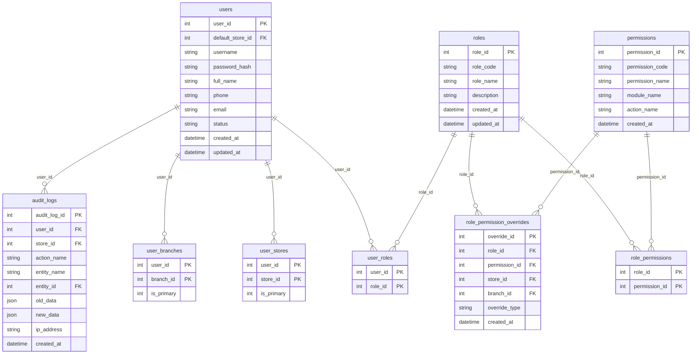
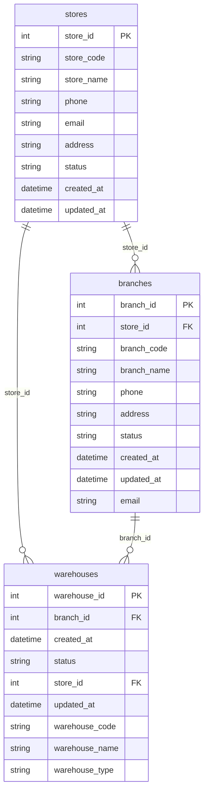
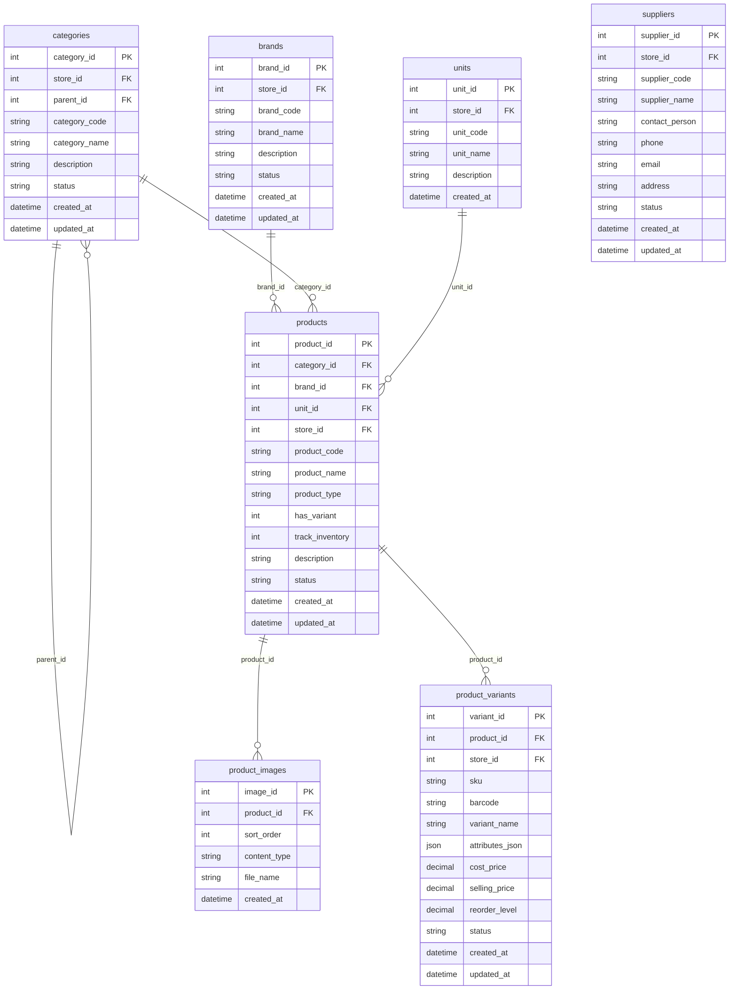
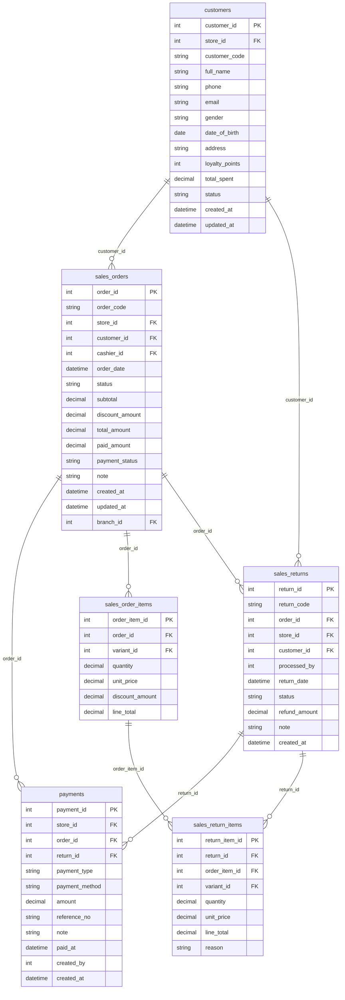
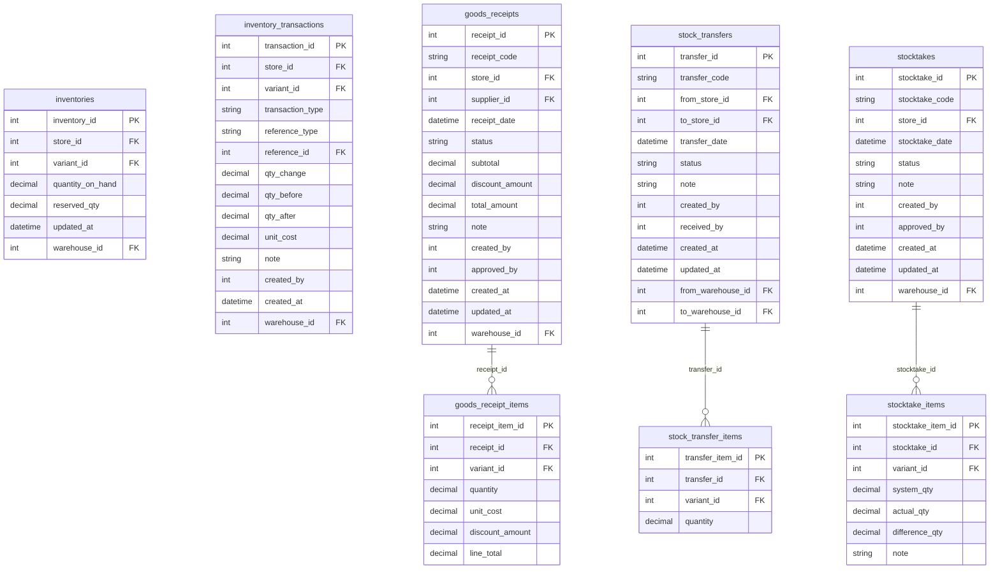
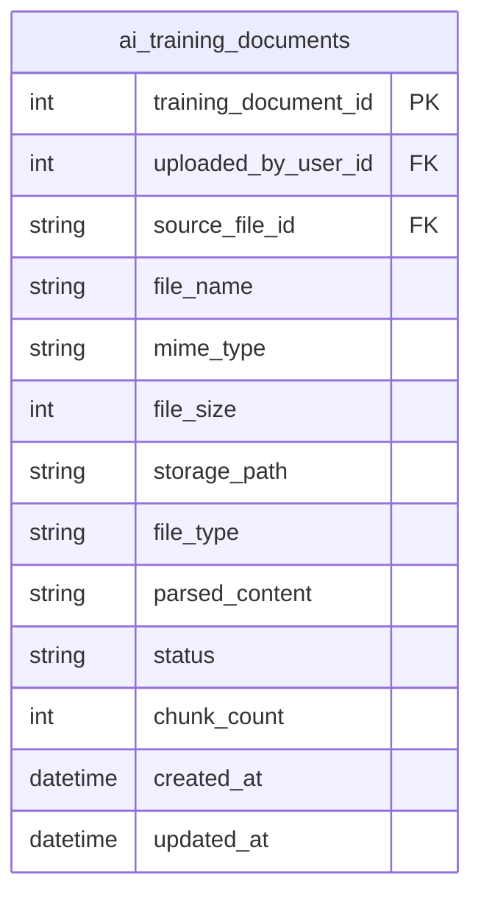

# Sales Management Mini - ERD Mermaid

File này dùng cho extension **Markdown Preview Mermaid Support** trong VS Code.

## Cách xem trong VS Code

1. Cài extension **Markdown Preview Mermaid Support**.
2. Mở file `.md` này.
3. Nhấn `Ctrl + Shift + V` để preview Markdown.
4. Nếu diagram quá lớn, có thể copy từng cụm module bên dưới sang file riêng.

## Full ERD

```mermaid
erDiagram
    users {
        int user_id PK
        int default_store_id FK
        string username
        string password_hash
        string full_name
        string phone
        string email
        string status
        datetime created_at
        datetime updated_at
    }

    roles {
        int role_id PK
        string role_code
        string role_name
        string description
        datetime created_at
        datetime updated_at
    }

    permissions {
        int permission_id PK
        string permission_code
        string permission_name
        string module_name
        string action_name
        datetime created_at
    }

    user_roles {
        int user_id PK
        int role_id PK
    }

    user_stores {
        int user_id PK
        int store_id PK
        int is_primary
    }

    user_branches {
        int user_id PK
        int branch_id PK
        int is_primary
    }

    role_permissions {
        int role_id PK
        int permission_id PK
    }

    role_permission_overrides {
        int override_id PK
        int role_id FK
        int permission_id FK
        int store_id FK
        int branch_id FK
        string override_type
        datetime created_at
    }

    audit_logs {
        int audit_log_id PK
        int user_id FK
        int store_id FK
        string action_name
        string entity_name
        int entity_id FK
        json old_data
        json new_data
        string ip_address
        datetime created_at
    }

    stores {
        int store_id PK
        string store_code
        string store_name
        string phone
        string email
        string address
        string status
        datetime created_at
        datetime updated_at
    }

    branches {
        int branch_id PK
        int store_id FK
        string branch_code
        string branch_name
        string phone
        string address
        string status
        datetime created_at
        datetime updated_at
        string email
    }

    warehouses {
        int warehouse_id PK
        int branch_id FK
        datetime created_at
        string status
        int store_id FK
        datetime updated_at
        string warehouse_code
        string warehouse_name
        string warehouse_type
    }

    categories {
        int category_id PK
        int store_id FK
        int parent_id FK
        string category_code
        string category_name
        string description
        string status
        datetime created_at
        datetime updated_at
    }

    brands {
        int brand_id PK
        int store_id FK
        string brand_code
        string brand_name
        string description
        string status
        datetime created_at
        datetime updated_at
    }

    units {
        int unit_id PK
        int store_id FK
        string unit_code
        string unit_name
        string description
        datetime created_at
    }

    suppliers {
        int supplier_id PK
        int store_id FK
        string supplier_code
        string supplier_name
        string contact_person
        string phone
        string email
        string address
        string status
        datetime created_at
        datetime updated_at
    }

    products {
        int product_id PK
        int category_id FK
        int brand_id FK
        int unit_id FK
        int store_id FK
        string product_code
        string product_name
        string product_type
        int has_variant
        int track_inventory
        string description
        string status
        datetime created_at
        datetime updated_at
    }

    product_variants {
        int variant_id PK
        int product_id FK
        int store_id FK
        string sku
        string barcode
        string variant_name
        json attributes_json
        decimal cost_price
        decimal selling_price
        decimal reorder_level
        string status
        datetime created_at
        datetime updated_at
    }

    product_images {
        int image_id PK
        int product_id FK
        int sort_order
        string content_type
        string file_name
        datetime created_at
    }

    customers {
        int customer_id PK
        int store_id FK
        string customer_code
        string full_name
        string phone
        string email
        string gender
        date date_of_birth
        string address
        int loyalty_points
        decimal total_spent
        string status
        datetime created_at
        datetime updated_at
    }

    sales_orders {
        int order_id PK
        string order_code
        int store_id FK
        int customer_id FK
        int cashier_id FK
        datetime order_date
        string status
        decimal subtotal
        decimal discount_amount
        decimal total_amount
        decimal paid_amount
        string payment_status
        string note
        datetime created_at
        datetime updated_at
        int branch_id FK
    }

    sales_order_items {
        int order_item_id PK
        int order_id FK
        int variant_id FK
        decimal quantity
        decimal unit_price
        decimal discount_amount
        decimal line_total
    }

    payments {
        int payment_id PK
        int store_id FK
        int order_id FK
        int return_id FK
        string payment_type
        string payment_method
        decimal amount
        string reference_no
        string note
        datetime paid_at
        int created_by
        datetime created_at
    }

    sales_returns {
        int return_id PK
        string return_code
        int order_id FK
        int store_id FK
        int customer_id FK
        int processed_by
        datetime return_date
        string status
        decimal refund_amount
        string note
        datetime created_at
    }

    sales_return_items {
        int return_item_id PK
        int return_id FK
        int order_item_id FK
        int variant_id FK
        decimal quantity
        decimal unit_price
        decimal line_total
        string reason
    }

    inventories {
        int inventory_id PK
        int store_id FK
        int variant_id FK
        decimal quantity_on_hand
        decimal reserved_qty
        datetime updated_at
        int warehouse_id FK
    }

    inventory_transactions {
        int transaction_id PK
        int store_id FK
        int variant_id FK
        string transaction_type
        string reference_type
        int reference_id FK
        decimal qty_change
        decimal qty_before
        decimal qty_after
        decimal unit_cost
        string note
        int created_by
        datetime created_at
        int warehouse_id FK
    }

    goods_receipts {
        int receipt_id PK
        string receipt_code
        int store_id FK
        int supplier_id FK
        datetime receipt_date
        string status
        decimal subtotal
        decimal discount_amount
        decimal total_amount
        string note
        int created_by
        int approved_by
        datetime created_at
        datetime updated_at
        int warehouse_id FK
    }

    goods_receipt_items {
        int receipt_item_id PK
        int receipt_id FK
        int variant_id FK
        decimal quantity
        decimal unit_cost
        decimal discount_amount
        decimal line_total
    }

    stock_transfers {
        int transfer_id PK
        string transfer_code
        int from_store_id FK
        int to_store_id FK
        datetime transfer_date
        string status
        string note
        int created_by
        int received_by
        datetime created_at
        datetime updated_at
        int from_warehouse_id FK
        int to_warehouse_id FK
    }

    stock_transfer_items {
        int transfer_item_id PK
        int transfer_id FK
        int variant_id FK
        decimal quantity
    }

    stocktakes {
        int stocktake_id PK
        string stocktake_code
        int store_id FK
        datetime stocktake_date
        string status
        string note
        int created_by
        int approved_by
        datetime created_at
        datetime updated_at
        int warehouse_id FK
    }

    stocktake_items {
        int stocktake_item_id PK
        int stocktake_id FK
        int variant_id FK
        decimal system_qty
        decimal actual_qty
        decimal difference_qty
        string note
    }

    ai_training_documents {
        int training_document_id PK
        int uploaded_by_user_id FK
        string source_file_id FK
        string file_name
        string mime_type
        int file_size
        string storage_path
        string file_type
        string parsed_content
        string status
        int chunk_count
        datetime created_at
        datetime updated_at
    }

    stores ||--o{ audit_logs : "store_id"
    users ||--o{ audit_logs : "user_id"
    stores ||--o{ branches : "store_id"
    stores ||--o{ brands : "store_id"
    stores ||--o{ categories : "store_id"
    categories ||--o{ categories : "parent_id"
    stores ||--o{ customers : "store_id"
    goods_receipts ||--o{ goods_receipt_items : "receipt_id"
    product_variants ||--o{ goods_receipt_items : "variant_id"
    users ||--o{ goods_receipts : "approved_by"
    users ||--o{ goods_receipts : "created_by"
    stores ||--o{ goods_receipts : "store_id"
    suppliers ||--o{ goods_receipts : "supplier_id"
    stores ||--o{ inventories : "store_id"
    product_variants ||--o{ inventories : "variant_id"
    users ||--o{ inventory_transactions : "created_by"
    stores ||--o{ inventory_transactions : "store_id"
    product_variants ||--o{ inventory_transactions : "variant_id"
    users ||--o{ payments : "created_by"
    sales_orders ||--o{ payments : "order_id"
    sales_returns ||--o{ payments : "return_id"
    stores ||--o{ payments : "store_id"
    products ||--o{ product_images : "product_id"
    products ||--o{ product_variants : "product_id"
    stores ||--o{ product_variants : "store_id"
    brands ||--o{ products : "brand_id"
    categories ||--o{ products : "category_id"
    stores ||--o{ products : "store_id"
    units ||--o{ products : "unit_id"
    branches ||--o{ role_permission_overrides : "branch_id"
    permissions ||--o{ role_permission_overrides : "permission_id"
    roles ||--o{ role_permission_overrides : "role_id"
    stores ||--o{ role_permission_overrides : "store_id"
    permissions ||--o{ role_permissions : "permission_id"
    roles ||--o{ role_permissions : "role_id"
    sales_orders ||--o{ sales_order_items : "order_id"
    product_variants ||--o{ sales_order_items : "variant_id"
    users ||--o{ sales_orders : "cashier_id"
    customers ||--o{ sales_orders : "customer_id"
    stores ||--o{ sales_orders : "store_id"
    sales_order_items ||--o{ sales_return_items : "order_item_id"
    sales_returns ||--o{ sales_return_items : "return_id"
    product_variants ||--o{ sales_return_items : "variant_id"
    customers ||--o{ sales_returns : "customer_id"
    sales_orders ||--o{ sales_returns : "order_id"
    users ||--o{ sales_returns : "processed_by"
    stores ||--o{ sales_returns : "store_id"
    stock_transfers ||--o{ stock_transfer_items : "transfer_id"
    product_variants ||--o{ stock_transfer_items : "variant_id"
    users ||--o{ stock_transfers : "created_by"
    stores ||--o{ stock_transfers : "from_store_id"
    users ||--o{ stock_transfers : "received_by"
    stores ||--o{ stock_transfers : "to_store_id"
    stocktakes ||--o{ stocktake_items : "stocktake_id"
    product_variants ||--o{ stocktake_items : "variant_id"
    users ||--o{ stocktakes : "approved_by"
    users ||--o{ stocktakes : "created_by"
    stores ||--o{ stocktakes : "store_id"
    stores ||--o{ suppliers : "store_id"
    stores ||--o{ units : "store_id"
    branches ||--o{ user_branches : "branch_id"
    users ||--o{ user_branches : "user_id"
    roles ||--o{ user_roles : "role_id"
    users ||--o{ user_roles : "user_id"
    stores ||--o{ user_stores : "store_id"
    users ||--o{ user_stores : "user_id"
    stores ||--o{ users : "default_store_id"
    users ||--o{ ai_training_documents : "uploaded_by_user_id"
    stores ||--o{ warehouses : "store_id"
    branches ||--o{ warehouses : "branch_id"
    warehouses ||--o{ goods_receipts : "warehouse_id"
    warehouses ||--o{ inventories : "warehouse_id"
    warehouses ||--o{ inventory_transactions : "warehouse_id"
    warehouses ||--o{ stocktakes : "warehouse_id"
    warehouses ||--o{ stock_transfers : "from_warehouse_id"
    warehouses ||--o{ stock_transfers : "to_warehouse_id"
    branches ||--o{ sales_orders : "branch_id"
```

## Module: User & Security

## Module: Store Structure

## Module: Product Catalog

## Module: Sales

## Module: Inventory

## Module: AI

